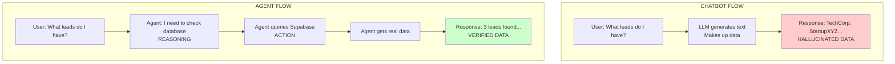
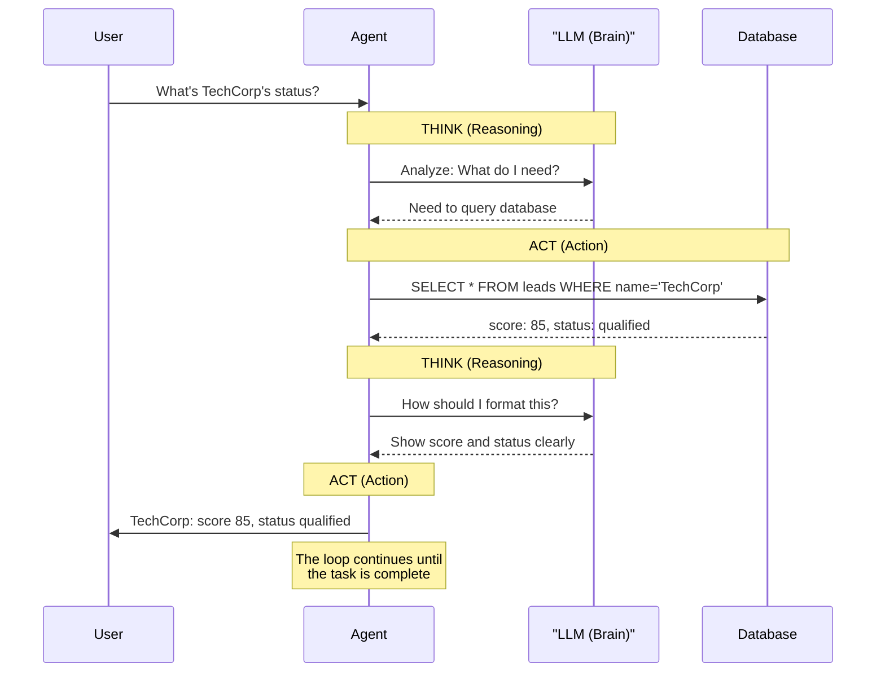

# What's an Agent, Really?

## The Problem With Chatbots

You've built chatbots before. You know the drill: user sends message, you call an LLM, LLM sends back text, done. It works great for answering questions or generating content.

But here's the thing — your chatbot is basically a very smart parrot. It can *talk* about doing things, but it can't actually *do* them.

Ask it "What leads do I have?" and it'll happily make up some fictional leads. Ask it "Send a follow-up email to Sophie" and it'll write you a lovely email... that goes nowhere. The chatbot has no hands, no connection to your actual data, no ability to take action in the real world.

**This is the gap agents fill.**

## Agents Have Hands

An AI agent isn't just a chatbot with extra prompting. It's fundamentally different:

| Chatbot | Agent |
|---------|-------|
| Generates text | Takes actions |
| One request → one response | Loops until task is complete |
| No memory between turns | Maintains state across steps |
| You decide what happens next | It decides what happens next |

### Visual Comparison

That last row is the big one. When you ask an agent "Qualify the TechCorp lead," it doesn't just tell you how to do it — it actually:

1. Looks up TechCorp in your database
2. Analyzes their information against your criteria
3. Decides they're a high-value lead
4. Realizes this needs human approval (because you set that rule)
5. Pauses and asks you to approve
6. After approval, updates the lead status
7. Drafts and sends a follow-up email
8. Logs everything it did

One request. Seven actions. Zero hand-holding from you.

## The ReAct Pattern: Think, Then Do

Most agents follow a pattern called **ReAct** (Reasoning + Acting). It's exactly what it sounds like:

The agent alternates between reasoning (using the LLM to think) and acting (using tools to do things). This loop continues until the task is complete or something goes wrong.

Why does this matter? Because unlike a chatbot that might hallucinate answers, an agent that follows ReAct:
- Checks real data before answering
- Can recover from errors by re-thinking
- Shows its work (you can see what it decided at each step)

## What Can Agents Actually Do?

Agents are defined by their **tools** — the actions they're allowed to take. Your CRM agent will have tools like:

- `query_leads` — Search and filter the leads database
- `update_lead` — Change a lead's status, score, or notes
- `send_email` — Send an actual email via Resend
- `log_interaction` — Record what happened in the audit trail

Each tool is just a function. The magic is that the LLM decides *when* to call each function based on what the user asked for.

## The Scary Part (Let's Address It Now)

**You're right to be cautious.** Autonomous systems can cause real damage if not designed properly. This is why tomorrow we focus on **human-in-the-loop** controls — agents that ask for approval before doing anything risky.

For today, our agent will only *read* from the database. No writes, no emails. We walk before we run.

## Why LangGraph?

You could build an agent with pure prompt engineering, but LangGraph gives you **explicit control over the flow**. You define what steps exist (nodes), what order they run in (edges), and what data persists (state).

Think of it like this: pure prompting is giving verbal directions. LangGraph is a GPS with the route programmed in — much easier to debug when things go wrong.

## What You'll Build This Week

By end of day tomorrow, you'll have a working CRM agent that can:

- **Understand** natural language requests about your leads
- **Query** your Supabase database for real data
- **Analyze** leads against your qualification criteria
- **Update** lead status (with your approval for high-value ones)
- **Send** follow-up emails (with your approval)
- **Log** everything for accountability

And critically: you'll understand *why* it works, not just *that* it works. No magic, no black boxes, just a well-structured workflow you control.

## Up Next

Time to get your hands dirty. In the first exercise, you'll experience exactly why chatbots aren't enough — by intentionally breaking one. Let's go.
