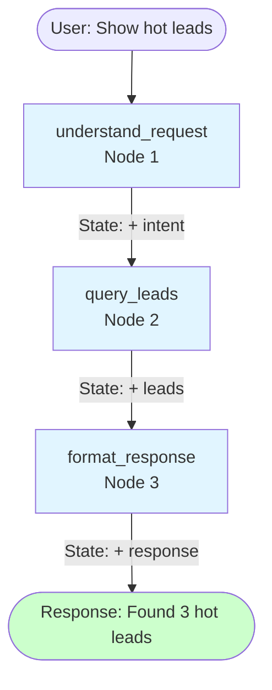
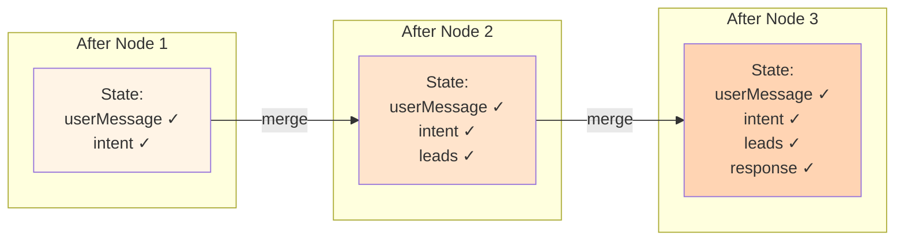
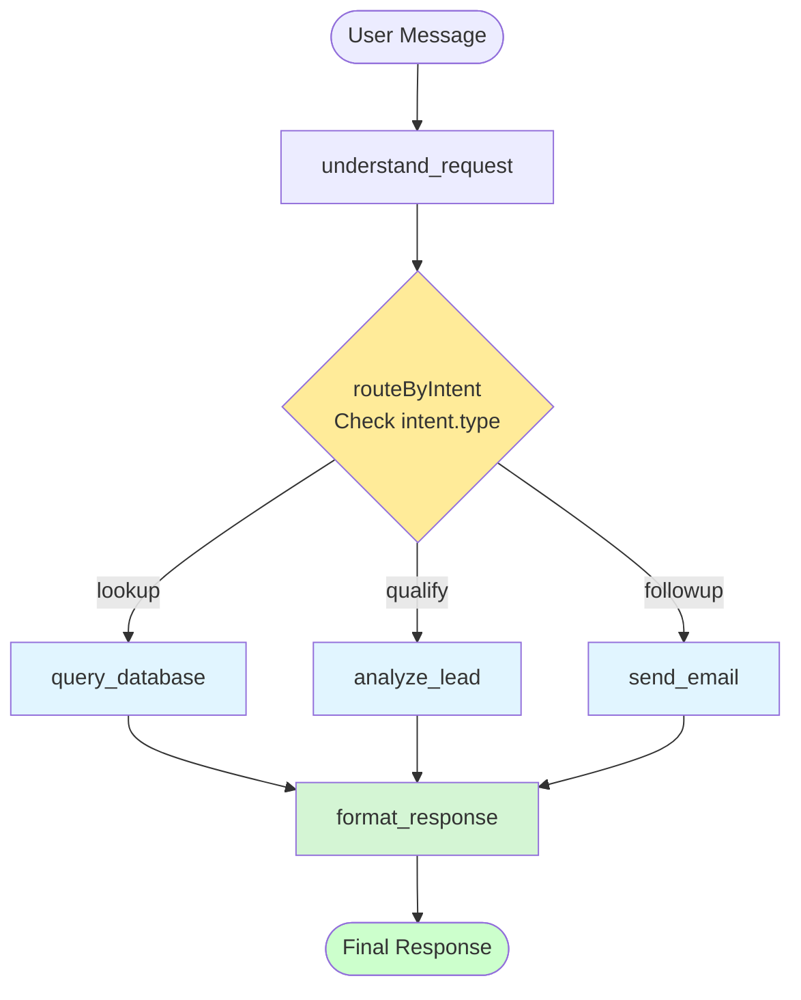
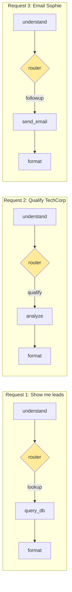

# The LangGraph Mental Model

## Forget Everything You Know About "Graphs"

When most people hear "graph," they think of bar charts or line graphs. That's not what we're talking about.

In computer science, a graph is just **things connected to other things**. That's it. Think of a subway map: stations (things) connected by lines (connections). Or a flowchart: boxes (things) connected by arrows (connections).

LangGraph uses this same idea to define how your agent thinks and acts.

## The Three Building Blocks

Every LangGraph workflow has exactly three ingredients:

### 1. Nodes — The "What"

A node is a single step in your workflow. It's just a function that does one thing:

```typescript
// This is a node. It takes state, does something, returns updated state.
function analyzeRequest(state: AgentState): AgentState {
  // Figure out what the user wants
  const intent = classifyIntent(state.userMessage);
  return { ...state, intent };
}
```

Your CRM agent will have nodes like:
- `understand_request` — Parse what the user asked for
- `query_leads` — Fetch data from Supabase
- `analyze_lead` — Score and qualify a lead
- `send_email` — Actually send the email
- `format_response` — Build the final answer

Each node has one job. This makes them easy to test, debug, and reason about.

### 2. Edges — The "When"

Edges connect nodes together. They define the order things happen:

```typescript
// After understand_request, go to query_leads
workflow.addEdge("understand_request", "query_leads");
```

Some edges are conditional — they go different places based on what happened:

```typescript
// After analyze_lead, route based on the lead's value
workflow.addConditionalEdges(
  "analyze_lead",
  (state) => state.leadScore > 80 ? "high_value" : "normal",
  {
    high_value: "human_approval",  // High value? Ask human first
    normal: "update_lead"          // Normal? Just update it
  }
);
```

This is where the power comes in. You're not hoping the LLM makes the right decision — you're encoding your business rules directly into the flow.

### 3. State — The "Memory"

State is the data that flows through your workflow. Every node can read from it and write to it:

```typescript
interface AgentState {
  userMessage: string;      // What the user asked
  intent: string | null;    // What we think they want
  leads: Lead[];            // Data from database
  response: string | null;  // Final answer
  error: string | null;     // If something went wrong
}
```

State is like a shared notebook. Node A writes something, Node B reads it, Node C updates it. Everyone's on the same page.

## A Visual Example

Here's what a simple workflow looks like:



**Key insight:** State accumulates as it flows. By the end, state contains: `userMessage`, `intent`, `leads`, AND `response`.

### State Accumulation



That's a straight line — understand, query, respond. Simple.

Now let's add a conditional branch (this is where the power comes in):



**What's happening:**
1. User asks something
2. `understand_request` classifies it
3. **Router** checks `intent.type` and picks the right handler (this is the magic!)
4. That handler does its job (query DB, analyze, send email)
5. All paths converge at `format_response`
6. User gets an answer

Different inputs take **different paths** through the same graph.

### Example Flow: Three Different Requests



Now the agent takes different paths based on what the user asked. "Show me my leads" goes left. "Qualify TechCorp" goes middle. "Follow up with Sophie" goes right.

## Why This Matters

You might be thinking: "Can't I just put all this logic in a prompt?"

You can. And for simple cases, you should! But prompts have problems:

**Problem 1: Reliability**

Prompts are probabilistic. Ask an LLM to "first check the database, then analyze, then respond" and sometimes it'll... just not. It'll skip steps, do them out of order, or forget entirely.

With LangGraph, the order is guaranteed. `query_leads` *will* run before `format_response`. Always.

**Problem 2: Debugging**

When a prompt-based agent misbehaves, good luck figuring out where it went wrong. The whole thing is one big blob.

With LangGraph, you can inspect the state after each node. "Ah, the intent was classified wrong in step 2. That's why everything else failed."

**Problem 3: Complexity**

Try adding human approval to a prompt-based agent. Now add retry logic. Now add three different paths based on user intent. Your prompt becomes a 500-line monster that's impossible to maintain.

LangGraph keeps things modular. Each node is isolated. You can add, remove, or modify nodes without breaking everything else.

## The Tradeoff

Nothing is free. LangGraph adds:

- **More code** — You're writing functions, not just prompts
- **More concepts** — Nodes, edges, state take time to understand
- **More rigidity** — Sometimes you want the LLM to be creative about the path

For simple use cases (Q&A, content generation), prompts are still king. LangGraph shines when:

- The task has multiple steps
- Some steps need to happen in a specific order
- Different inputs should take different paths
- You need to pause for human input
- Reliability matters more than flexibility

Building a CRM agent? That's LangGraph territory.

## Quick Reference

| Concept | What it is | In code |
|---------|------------|---------|
| Node | A function that does one thing | `workflow.addNode("name", fn)` |
| Edge | Connection between nodes | `workflow.addEdge("from", "to")` |
| Conditional Edge | Connection that depends on state | `workflow.addConditionalEdges(...)` |
| State | Shared data between nodes | `interface AgentState { ... }` |
| Entry point | Where execution starts | `workflow.setEntryPoint("name")` |
| Compile | Finalize the workflow | `workflow.compile()` |

## Up Next

Enough theory. Let's write your first node and see this in action.
