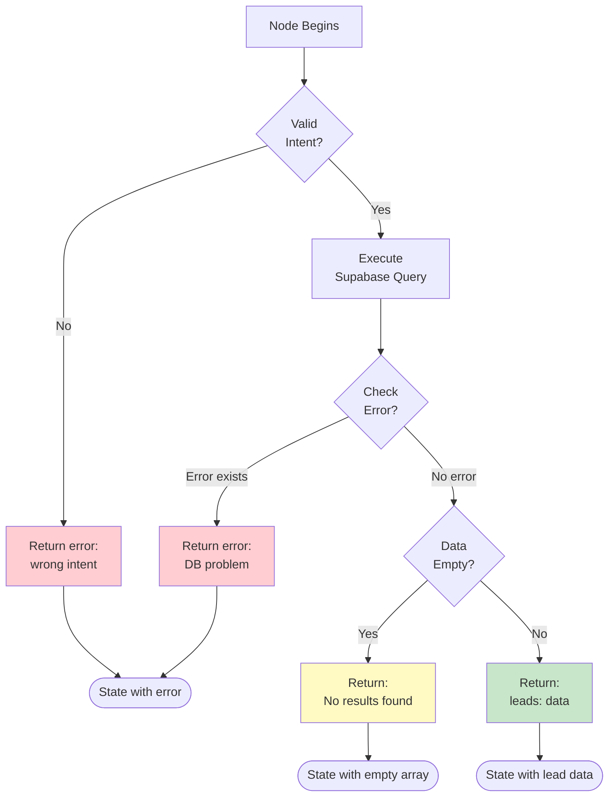
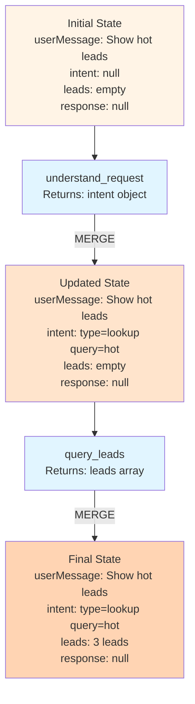
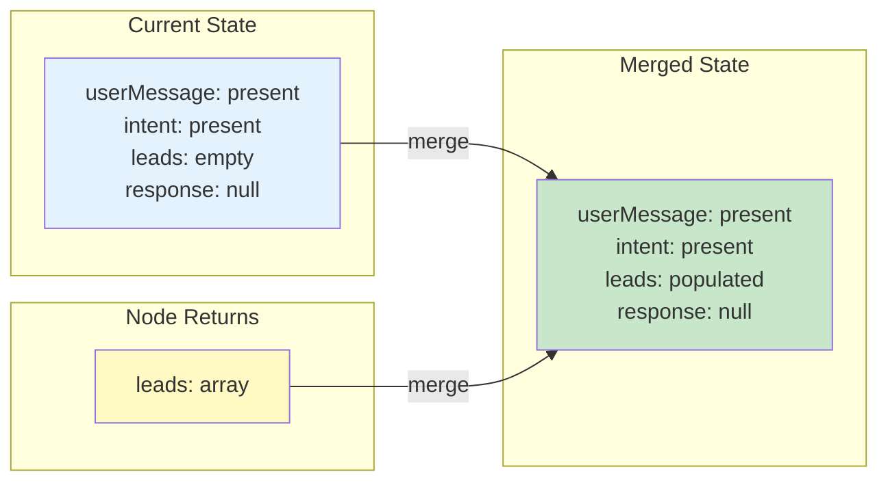

# State and Data: Making Your Agent Remember

## Part 1: Why State Matters (10 min)

### The Problem of Forgetful Functions

Here's something that trips up a lot of people: regular functions don't remember anything.

```typescript
function step1() {
  const result = doSomething();
  // result exists here...
}

function step2() {
  // ...but not here. result is gone.
}
```

If you call `step1()` then `step2()`, they can't share information. This is a problem for agents where your `understand_request` node figures out what the user wants, and your `query_leads` node needs that information.

**Answer: State.**

### State is the Shared Notebook

In LangGraph, every node receives the current state and returns an updated state:

```typescript
// Every node has this signature
function myNode(state: AgentState): Partial<AgentState> {
  const userMessage = state.userMessage;  // Read from state
  const intent = analyzeMessage(userMessage);  // Do something
  return { intent };  // Return updates (merged automatically)
}
```

You don't return the *entire* state, just the parts you changed.

### Designing Your State

Here's the state for our CRM agent:

```typescript
interface AgentState {
  // Input
  userMessage: string;
  
  // Understanding
  intent: AgentIntent | null;
  
  // Data
  leads: Lead[];
  selectedLead: Lead | null;
  
  // Output
  response: string | null;
  
  // Error handling
  error: string | null;
}
```

**Key insight:** State sections organize by *purpose* — input, understanding, data, output, errors. This makes debugging easier.

### Common State Mistakes

**Mistake 1:** Putting everything in `data: any` — be specific, your future self will thank you.

**Mistake 2:** Forgetting history. Always keep arrays of actions:
```typescript
completedActions: Action[];  // Not just currentAction
```

**Mistake 3:** No error tracking. If something fails, put it in state:
```typescript
return { error: e.message, currentStep: "error_handler" };
```

### State Updates are Merges

When you return from a node, you're not replacing state — you're merging:

```typescript
// Current state: { userMessage: "Hello", intent: null, leads: [] }
// Node returns: { intent: { type: "lookup" } }
// Result: { userMessage: "Hello", intent: { type: "lookup" }, leads: [] }
```

**Watch out for arrays:**
```typescript
// To append, spread the existing array:
return { leads: [...state.leads, newLead] };
```

---

## Part 2: Connecting to Real Data (15 min)

### Your Agent Needs Data

Your CRM lives in Supabase. Your agent needs to query leads based on user requests. Today we focus on reading (writing comes tomorrow with safety guards).

### Supabase in Edge Functions

You've used the Supabase client in React. Edge Functions are similar, but use the **service role key** for full access:

```typescript
// Frontend (restricted access)
const supabase = createClient(url, anonKey);

// Edge Function (full access)
const supabase = createClient(url, serviceRoleKey);
```

**This is powerful and dangerous.** Service role can do anything. Never expose this key to clients.

### Setup Code

```typescript
import { createClient } from "https://esm.sh/@supabase/supabase-js@2";

const supabaseUrl = Deno.env.get("SUPABASE_URL")!;
const supabaseKey = Deno.env.get("SUPABASE_SERVICE_ROLE_KEY")!;
const supabase = createClient(supabaseUrl, supabaseKey);
```

### Essential Query Patterns

```typescript
// Get all leads
const { data, error } = await supabase
  .from("leads")
  .select("*")
  .order("score", { ascending: false });

// Filter: high scores
query = query.gt("score", 80);

// Filter: exact match
query = query.eq("status", "new");

// Filter: contains (case-insensitive)
query = query.ilike("company_name", `%${searchTerm}%`);
```

**Always check for errors:**

```typescript
if (error) {
  return { 
    error: `Database error: ${error.message}`,
    currentStep: "error_handler"
  };
}
```

### The Supabase Gotcha

Supabase queries **don't throw errors** — they return them:

```typescript
const { data, error } = await supabase.from("leads").select("*");

// You MUST check error manually
if (error) {
  // Handle it
}
```

### Query Error Handling Flow



### Turning Queries into Nodes

Here's a complete query node:

```typescript
async function queryLeads(state: AgentState): Promise<Partial<AgentState>> {
  if (!state.intent || state.intent.type !== "lookup") {
    return { error: "queryLeads called with wrong intent" };
  }

  try {
    let query = supabase.from("leads").select("*");
    
    const searchQuery = state.intent.query;
    if (searchQuery === "hot") {
      query = query.gt("score", 80);
    } else if (searchQuery === "new") {
      query = query.eq("status", "new");
    } else {
      query = query.ilike("company_name", `%${searchQuery}%`);
    }
    
    const { data, error } = await query.order("score", { ascending: false });
    
    if (error) {
      return { 
        error: `Database error: ${error.message}`,
        currentStep: "error_handler"
      };
    }
    
    return { 
      leads: data || [],
      currentStep: "format_response"
    };
    
  } catch (e) {
    return { 
      error: `Unexpected error: ${e.message}`,
      currentStep: "error_handler"
    };
  }
}
```

Notice the defensive coding:
- Validate intent before querying
- Handle both Supabase errors and exceptions
- Always set the next step explicitly
- Return empty array instead of null

### Security: Keep Secrets Secret

Your service role key can do *anything*. Rules:

1. **Never hardcode it** — use environment variables
2. **Never log it** — even in debug mode
3. **Never return it** — don't include it in responses

```typescript
// NEVER DO THIS
console.log("Using key:", supabaseKey);  // ❌

// GOOD - key stays invisible
const supabase = createClient(url, key);  // ✅
```

---

## Visual: How State Flows Through Data Nodes



### State Merge Behavior



---

## Key Takeaways

### About State:
- State is the shared memory between nodes
- You return **partial updates**, not the whole state
- Organize state by purpose (input, understanding, data, output, errors)
- Always track history and errors

### About Data:
- Use service role key for full database access (never expose it!)
- Supabase queries return errors, they don't throw
- Always validate and handle errors in nodes
- Set the next step explicitly in your returns

## Quick Reference

| Pattern | Usage |
|---------|-------|
| Read from state | `const message = state.userMessage;` |
| Update one field | `return { intent: value };` |
| Update multiple | `return { intent: value, response: value };` |
| Append to array | `return { leads: [...state.leads, newLead] };` |
| Filter query | `query.gt("score", 80)` |
| Search query | `query.ilike("name", "%search%")` |
| Error check | `if (error) return { error: error.message };` |

## Up Next

You've learned how state flows and how to fetch data. Now let's build the complete workflow: intent classification → routing → database query → formatted response. Everything together!
