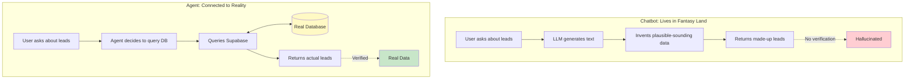
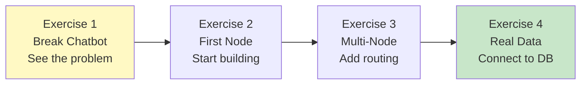

# Exercise 1: Break a Chatbot (Intentionally)

## Learning Objectives

By the end of this exercise, you'll:
- Experience the exact limitations of prompt-only chatbots
- Understand why agents exist (not just theoretically — you'll feel it)
- Identify the gap between "talking about doing" and "actually doing"

## Scenario

Your marketing team has been using a basic ChatGPT-style chatbot for lead questions. They keep complaining: "It makes stuff up!" and "It can't actually do anything useful!"

Your job: prove them right. Then fix it with an agent.

## Your Task

### 🤖 Using Cursor Effectively in This Exercise

In this exercise, you'll use Cursor to help you set up the chatbot quickly. Here's how:

1. **Copy the template code** (provided below)
2. **Use Cursor to explain unfamiliar parts**: Highlight any code you don't understand, press `Cmd+L` (or `Ctrl+L` on Windows), and ask: "What does this code do?"
3. **Fix errors with Cursor**: If you get an error, copy the error message, press `Cmd+K` (or `Ctrl+K`), and ask: "How do I fix this error?"

**Remember:** The goal is to understand *why* chatbots are limited, not just to make code work. Use Cursor to accelerate setup, not to skip understanding.

---

### Step 1: Set Up a Basic Chatbot (10 min)

Create a new file called `chatbot-test.ts` in your project:

```typescript
// chatbot-test.ts
import Anthropic from "@anthropic-ai/sdk";

const client = new Anthropic({
  apiKey: process.env.ANTHROPIC_API_KEY,
});

const SYSTEM_PROMPT = `You are a helpful CRM assistant. You help users manage their sales leads.

The user has the following leads in their database:
- TechCorp Solutions (Sophie Martin) - Score: 85, Status: qualified
- StartupXYZ (Marcus Chen) - Score: 40, Status: new  
- GlobalRetail Inc (Amanda Rodriguez) - Score: 92, Status: proposal
- LocalCafe (Tom Wilson) - Score: 25, Status: contacted
- MegaBank Financial (Dr. James Wright) - Score: 78, Status: qualified

When users ask about leads, reference this information.
When users ask you to take actions (send emails, update status), do your best to help.`;

async function chat(userMessage: string): Promise<string> {
  const response = await client.messages.create({
    model: "claude-3-5-sonnet-20241022",
    max_tokens: 1024,
    system: SYSTEM_PROMPT,
    messages: [{ role: "user", content: userMessage }],
  });
  
  return response.content[0].type === "text" 
    ? response.content[0].text 
    : "No response";
}

// Test it
async function main() {
  console.log("Testing chatbot...\n");
  
  const testMessage = process.argv[2] || "Show me my hot leads";
  console.log(`User: ${testMessage}`);
  
  const response = await chat(testMessage);
  console.log(`\nBot: ${response}`);
}

main();
```

Run it with:
```bash
npx ts-node chatbot-test.ts "Show me my hot leads"
```

### Step 2: Ask Questions It CAN Answer (5 min)

Try these prompts and observe what happens:

```bash
npx ts-node chatbot-test.ts "Which lead has the highest score?"
npx ts-node chatbot-test.ts "Tell me about TechCorp"
npx ts-node chatbot-test.ts "What's Sophie's email?"
```

**Write down:** What works well? The chatbot probably does okay here.

### Step 3: Now Break It (15 min)

Try these prompts and watch it fail:

```bash
# Ask about data that's NOT in the prompt
npx ts-node chatbot-test.ts "Show me all leads created this week"

# Ask it to do something
npx ts-node chatbot-test.ts "Send a follow-up email to Sophie at TechCorp"

# Ask about current state
npx ts-node chatbot-test.ts "Did anyone update the TechCorp lead today?"

# Ask it to update something
npx ts-node chatbot-test.ts "Mark LocalCafe as lost - they went with a competitor"

# Now really break it - add a fictional lead
npx ts-node chatbot-test.ts "What's the status of the AcmeCorp lead?"
```

### Step 4: Document the Failures (10 min)

For each failure, write down:

1. **What you asked:**
2. **What the chatbot said:**
3. **What's wrong with that response:**
4. **What would an agent do differently:**

Use this table:

| Prompt | Chatbot Response | Problem | Agent Would... |
|--------|------------------|---------|----------------|
| "Show me leads from this week" | [Made up data] | Can't query real database | Actually query Supabase with date filter |
| "Send email to Sophie" | "I'll send..." | No actual email sent | Call Resend API, log interaction |
| ... | ... | ... | ... |

## Success Criteria

- [ ] You ran at least 5 different prompts
- [ ] You identified at least 3 distinct failure modes
- [ ] You can explain why a chatbot can't solve these problems
- [ ] You have a list of what an agent would need to do differently

## Debugging Tips

**If the chatbot won't run:**
- Check your `ANTHROPIC_API_KEY` is set in `.env`
- Make sure you have `@anthropic-ai/sdk` installed: `npm install @anthropic-ai/sdk`

**If it's too slow:**
- Claude is thinking. Wait for it.
- If it takes more than 30 seconds, check your internet connection.

## Discussion Questions

Before moving on, think about:

1. The chatbot "knows" about 5 leads. What happens when the real database has 500? 5000?

2. The chatbot claims to send emails. How would you know if it actually did?

3. If you tell the chatbot to "update TechCorp status to won" and then ask "what's TechCorp's status?" — what happens? Why?

4. How would you add a new lead to the chatbot's knowledge? (Hint: this is the core problem)

## What You Just Learned

Chatbots are **stateless text generators**. They:
- Can only "know" what's in the prompt
- Can only "do" what text generation allows
- Have no memory between messages
- Cannot verify their claims against reality

### The Core Problem Visualized



Agents solve this by adding:
- **Tools**: Real connections to databases and APIs
- **State**: Memory that persists across steps
- **Verification**: The ability to check results against reality

### Your Learning Journey



Up next: we'll build the first piece of a real agent — a node that actually does something.

## Stretch Goal (If You Finish Early)

Try to "jailbreak" the chatbot into admitting its limitations:

```bash
npx ts-node chatbot-test.ts "Be honest - can you actually see my database or are you just guessing?"
```

Some LLMs will admit it. Others will double down on the fiction. Either way, it's illuminating.
