# Exercise 2: Your First Node

## Learning Objectives

By the end of this exercise, you'll:
- Create a working LangGraph node from scratch
- Understand the node signature (state in → state out)
- Use Claude to classify user intent
- See state updates in action

## Scenario

The first step of any CRM agent is understanding what the user wants. "Show me hot leads" is different from "send a follow-up to Sophie." Before your agent can act, it needs to classify the intent.

You'll build the `understand_request` node — the brain that figures out what to do next.

## Your Task

### 🤖 Using Cursor Effectively in This Exercise

This exercise requires you to write real logic. Here's the Cursor workflow that works best:

**Step 1: Think First (2 minutes)**
- Read the TODO comments
- Write pseudocode in comments: "// 1. Get user message, 2. Ask Claude to classify..."

**Step 2: Use Cursor for Implementation**
- Highlight your pseudocode
- Press `Cmd+K` (or `Ctrl+K`)
- Ask: "Implement this logic to classify CRM intents into lookup, qualify, followup, update, or unknown"

**Step 3: Review and Understand**
- Don't just accept Cursor's suggestion blindly
- Ask yourself: "Does this match what I learned in the lecture about nodes?"
- If unclear, highlight the code and press `Cmd+L` to ask: "Explain how this works step by step"

**What NOT to do:**
- ❌ Ask Cursor to write the whole exercise
- ❌ Copy code without reading it
- ✅ Use Cursor to implement YOUR logic after YOU understand the problem

---

### Step 1: Set Up Your Agent File (5 min)

Create `agent.ts` in your `edge-function-scaffold` folder:

```typescript
// agent.ts
import { StateGraph, END } from "@langchain/langgraph";
import Anthropic from "@anthropic-ai/sdk";

// Your state definition
interface AgentState {
  userMessage: string;
  intent: {
    type: "lookup" | "qualify" | "followup" | "update" | "unknown";
    target?: string;  // Company name or lead ID
    details?: string; // Any extra info
  } | null;
  response: string | null;
  error: string | null;
}

// Initialize Claude client
const anthropic = new Anthropic({
  apiKey: Deno.env.get("ANTHROPIC_API_KEY"),
});

// TODO: You'll implement this node
async function understandRequest(state: AgentState): Promise<Partial<AgentState>> {
  // Your code here
}
```

### Step 2: Implement the Intent Classifier (25 min)

Your `understandRequest` node needs to:
1. Take the user's message from state
2. Ask Claude to classify it
3. Return the classified intent

Here's the skeleton — fill in the TODO sections:

```typescript
async function understandRequest(state: AgentState): Promise<Partial<AgentState>> {
  const userMessage = state.userMessage;
  
  // TODO: Create a prompt that asks Claude to classify the intent
  // The prompt should explain the possible intent types:
  // - lookup: User wants to see/find leads
  // - qualify: User wants to analyze/score a lead
  // - followup: User wants to send communication
  // - update: User wants to change lead data
  // - unknown: Can't determine what user wants
  
  const classificationPrompt = `
    [YOUR PROMPT HERE]
    
    User message: "${userMessage}"
    
    Respond with JSON only, no explanation:
    { "type": "lookup|qualify|followup|update|unknown", "target": "company name if mentioned", "details": "any other relevant info" }
  `;
  
  try {
    // TODO: Call Claude to classify the intent
    const response = await anthropic.messages.create({
      model: "claude-3-5-sonnet-20241022",
      max_tokens: 256,
      messages: [{ role: "user", content: classificationPrompt }],
    });
    
    // TODO: Parse the response
    // Hint: response.content[0].text contains the JSON string
    // Hint: Use JSON.parse() but wrap it in try/catch
    
    const intentJson = /* parse the response here */;
    
    // TODO: Return the updated state
    return {
      intent: intentJson,
      // What else should you return?
    };
    
  } catch (error) {
    // TODO: Handle errors gracefully
    // Don't let the whole agent crash because of a parsing error
    return {
      // What should you return on error?
    };
  }
}
```

**💡 Cursor AI Prompts That Work:**
- "Help me write a prompt that classifies CRM user intents into lookup, qualify, followup, or update categories"
- "How do I safely parse JSON from an LLM response that might have extra text?"
- "Add error handling for this JSON parsing code"
- "Explain why this intent classification might fail"

**🎯 Pro Tip:** After Cursor suggests code, ask it: "What could go wrong with this approach?" This helps you think about edge cases.

### Step 3: Test Your Node Standalone (10 min)

Before wiring it into a graph, test the node by itself:

```typescript
// Add this at the bottom of agent.ts for testing
async function testNode() {
  const testCases = [
    "Show me all my leads",
    "What's the status of TechCorp?",
    "Send a follow-up email to Sophie",
    "Mark GlobalRetail as won",
    "Hello, how are you?",  // Should be "unknown"
  ];
  
  for (const message of testCases) {
    console.log(`\n--- Testing: "${message}" ---`);
    
    const initialState: AgentState = {
      userMessage: message,
      intent: null,
      response: null,
      error: null,
    };
    
    const result = await understandRequest(initialState);
    console.log("Result:", JSON.stringify(result, null, 2));
  }
}

testNode();
```

Run with:
```bash
deno run --allow-env --allow-net agent.ts
```

### Step 4: Wire It Into a Graph (5 min)

Now let's create an actual LangGraph workflow with your node:

```typescript
// Create the graph
const workflow = new StateGraph<AgentState>({
  channels: {
    userMessage: { value: (a, b) => b ?? a },
    intent: { value: (a, b) => b ?? a },
    response: { value: (a, b) => b ?? a },
    error: { value: (a, b) => b ?? a },
  },
});

// Add your node
workflow.addNode("understand_request", understandRequest);

// For now, just go straight to END after understanding
workflow.setEntryPoint("understand_request");
workflow.addEdge("understand_request", END);

// Compile the graph
const app = workflow.compile();

// Test the full graph
async function testGraph() {
  const result = await app.invoke({
    userMessage: "Show me hot leads",
    intent: null,
    response: null,
    error: null,
  });
  
  console.log("Final state:", JSON.stringify(result, null, 2));
}

testGraph();
```

## Success Criteria

- [ ] Your node correctly classifies "Show me all leads" as `lookup`
- [ ] Your node correctly classifies "Send email to Sophie" as `followup`
- [ ] Your node correctly classifies "gibberish xyz" as `unknown`
- [ ] Your node handles Claude API errors without crashing
- [ ] You can explain what the node returns and why

## Debugging Tips

**If Claude returns malformed JSON:**
```typescript
// Extract JSON from response that might have extra text
function extractJson(text: string): any {
  // Find content between first { and last }
  const start = text.indexOf("{");
  const end = text.lastIndexOf("}");
  if (start === -1 || end === -1) {
    throw new Error("No JSON found in response");
  }
  return JSON.parse(text.slice(start, end + 1));
}
```

**If the intent is always "unknown":**
- Check your prompt. Is it clear what each category means?
- Add examples to your prompt (few-shot prompting)

**If you get API errors:**
- Verify `ANTHROPIC_API_KEY` is set
- Check you have API credits

## What You Just Built

You now have a node that:
1. Receives state (with user message)
2. Calls an external service (Claude)
3. Processes the response
4. Returns updated state (with classified intent)

### Visual: What Your Node Does

```mermaid
sequenceDiagram
    participant Graph as LangGraph
    participant Node as understandRequest
    participant Claude as Claude API
    
    Graph->>Node: State in: {userMessage: "Show me leads"}
    
    Note over Node: Read user message from state
    
    Node->>Claude: Classify this intent
    Claude-->>Node: {type: "lookup", target: "leads"}
    
    Note over Node: Parse JSON response
    
    Node->>Graph: Returns: {intent: {...}}
    
    Note over Graph: Merges update into state
    
    rect rgb(200, 250, 200)
        Note over Graph: State now has:<br/>userMessage ✓<br/>intent ✓
    end
```



This is the fundamental pattern. Every node in your agent will follow this same structure: read state → do something → return updates.

### The Node Pattern (Use This Template!)


## Stretch Goal

Add confidence scoring to your intent classification:

```typescript
interface Intent {
  type: "lookup" | "qualify" | "followup" | "update" | "unknown";
  target?: string;
  details?: string;
  confidence: "high" | "medium" | "low";  // Add this
}
```

Modify your prompt to have Claude also estimate how confident it is. This will be useful later when we add fallback behaviors for low-confidence classifications.
