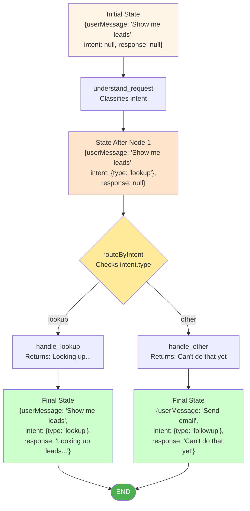
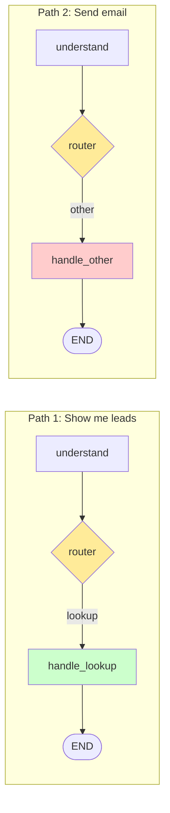

# Exercise 3: Multi-Node Flow

## Learning Objectives

By the end of this exercise, you'll:
- Connect multiple nodes together with edges
- Implement conditional routing based on state
- See how state flows through a multi-step workflow
- Debug a workflow by inspecting state between nodes

## Scenario

Your intent classifier works, but it's useless on its own. Now you need to route different intents to different handlers. When someone asks to "see leads," we query the database. When they ask to "send an email," we... well, for now, we'll just acknowledge it. One step at a time.

## Your Task

### 🤖 Using Cursor Effectively in This Exercise

You're building a multi-node workflow. Here's the optimal Cursor strategy:

**For Node Creation (Step 1):**
- Copy the node template provided
- Use Cursor Chat (`Cmd+L` / `Ctrl+L`) to ask: "Show me how to add these nodes to my existing agent.ts"

**For Router Logic (Step 2):**
- Write the if/else logic yourself first (it's simple!)
- Only use Cursor if you get stuck: "Help me write a router that returns 'handle_lookup' for lookup intents"

**For Graph Wiring (Step 3):**
- This is where Cursor really helps. The syntax is new and tricky.
- Highlight the TODO sections
- Ask: "Complete this conditional edge setup for LangGraph"

**For Debugging (Step 5):**
- When something breaks, copy the error
- Ask Cursor: "I got this error in my LangGraph workflow: [error]. What's wrong?"

**The Learning Principle:**
- ✅ Use Cursor for syntax you haven't memorized yet (graph setup)
- ❌ Use Cursor for logic you should understand (router if/else)

---

### Step 1: Add Two More Nodes (15 min)

You have `understandRequest`. Now add two more nodes to your `agent.ts`:

```typescript
// Node 2: Handle lookup requests
async function handleLookup(state: AgentState): Promise<Partial<AgentState>> {
  // For now, just acknowledge the request
  // We'll add real Supabase queries in the next exercise
  
  const target = state.intent?.target || "all leads";
  
  return {
    response: `Looking up ${target}... (database query will go here)`,
  };
}

// Node 3: Handle other requests (placeholder)
async function handleOther(state: AgentState): Promise<Partial<AgentState>> {
  const intentType = state.intent?.type || "unknown";
  
  if (intentType === "unknown") {
    return {
      response: "I'm not sure what you're asking. Try something like 'Show me hot leads' or 'What's the status of TechCorp?'",
    };
  }
  
  // For now, acknowledge but don't do anything
  return {
    response: `I understood you want to ${intentType}, but I can't do that yet. Coming tomorrow!`,
  };
}
```

### Step 2: Create the Router Function (10 min)

The router decides which node runs next based on the current state:

```typescript
// This function decides where to go after understanding the request
function routeByIntent(state: AgentState): string {
  // TODO: Implement the routing logic
  // Return "handle_lookup" if intent type is "lookup"
  // Return "handle_other" for everything else
  
  const intentType = state.intent?.type;
  
  // Your logic here
  // Hint: if (intentType === "lookup") return "handle_lookup";
  
}
```

**Important:** The router function returns a *string* — the name of the next node. It doesn't modify state.

### Step 3: Build the Graph (15 min)

Now wire everything together:

```typescript
import { StateGraph, END } from "@langchain/langgraph";

// Define state channels (how state updates are merged)
const workflow = new StateGraph<AgentState>({
  channels: {
    userMessage: { value: (a, b) => b ?? a },
    intent: { value: (a, b) => b ?? a },
    response: { value: (a, b) => b ?? a },
    error: { value: (a, b) => b ?? a },
  },
});

// Add all nodes
workflow.addNode("understand_request", understandRequest);
workflow.addNode("handle_lookup", handleLookup);
workflow.addNode("handle_other", handleOther);

// Set the entry point
workflow.setEntryPoint("understand_request");

// TODO: Add conditional edges from understand_request
// This says: "after understand_request, run routeByIntent to decide where to go"
workflow.addConditionalEdges(
  "understand_request",
  routeByIntent,
  {
    handle_lookup: "handle_lookup",
    handle_other: "handle_other",
  }
);

// TODO: Add edges from handler nodes to END
// After handling, we're done
workflow.addEdge("handle_lookup", END);
workflow.addEdge("handle_other", END);

// Compile
const app = workflow.compile();
```

### Step 4: Test Different Paths (10 min)

Test that different messages take different paths:

```typescript
async function testRouting() {
  const testCases = [
    { message: "Show me all leads", expectedPath: "lookup" },
    { message: "What's TechCorp's status?", expectedPath: "lookup" },
    { message: "Send email to Sophie", expectedPath: "other" },
    { message: "Mark lead as won", expectedPath: "other" },
    { message: "Hello there!", expectedPath: "other/unknown" },
  ];
  
  for (const { message, expectedPath } of testCases) {
    console.log(`\n${"=".repeat(50)}`);
    console.log(`Testing: "${message}"`);
    console.log(`Expected path: ${expectedPath}`);
    
    const result = await app.invoke({
      userMessage: message,
      intent: null,
      response: null,
      error: null,
    });
    
    console.log(`Intent classified: ${result.intent?.type}`);
    console.log(`Response: ${result.response}`);
    
    // Verify it went the right way
    const wentLookup = result.response?.includes("Looking up");
    console.log(`Actually went: ${wentLookup ? "lookup" : "other"}`);
  }
}

testRouting();
```

### Step 5: Add Debug Logging (5 min)

Real agents are hard to debug without visibility. Add logging to see what's happening:

```typescript
// Wrap any node with logging
function withLogging<T extends AgentState>(
  nodeName: string,
  fn: (state: T) => Promise<Partial<T>>
): (state: T) => Promise<Partial<T>> {
  return async (state: T) => {
    console.log(`\n[${nodeName}] ENTER`);
    console.log(`[${nodeName}] State:`, JSON.stringify(state, null, 2));
    
    const result = await fn(state);
    
    console.log(`[${nodeName}] RETURN:`, JSON.stringify(result, null, 2));
    return result;
  };
}

// Use it when adding nodes
workflow.addNode("understand_request", withLogging("understand_request", understandRequest));
workflow.addNode("handle_lookup", withLogging("handle_lookup", handleLookup));
workflow.addNode("handle_other", withLogging("handle_other", handleOther));
```

## Success Criteria

- [ ] "Show me leads" routes to `handle_lookup`
- [ ] "Send an email" routes to `handle_other`
- [ ] "Hello!" routes to `handle_other` with "unknown" intent
- [ ] You can see the state at each step via logging
- [ ] No messages cause the graph to crash

## Debugging Tips

**If routing always goes to the same node:**
- Print `state.intent` in your router function
- Check that `understandRequest` is actually setting the intent
- Make sure your router returns the exact string names you used in `addConditionalEdges`

**If you get "node not found" errors:**
- The names in `addConditionalEdges` must exactly match the names in `addNode`
- Check for typos: `"handle_lookup"` vs `"handleLookup"`

**If the graph runs forever:**
- You forgot `workflow.addEdge(nodeName, END)` for some node
- Every path through the graph must eventually reach `END`

## Visualizing Your Graph

Your workflow now looks like this:



**Key insight:** State accumulates as it flows. Different messages take different paths, but all end up with a `response` field populated.

### Two Different User Inputs, Two Different Paths



## What You Just Built

You now have a **multi-node workflow with conditional routing**. This is the core pattern for all agents:

1. **Entry node** processes the input
2. **Router** decides what to do based on state
3. **Handler nodes** do the actual work
4. **END** terminates the workflow

Tomorrow, you'll add more sophisticated routing (like pausing for human approval). But the pattern stays the same.

## Stretch Goal

Add a third path: route `qualify` intents to a dedicated `handle_qualify` node.

The node should:
1. Check if the intent has a target (company name)
2. If yes, return a message like "Analyzing TechCorp for qualification..."
3. If no target, return "Which lead would you like me to qualify?"

This preview the pattern you'll use tomorrow when `handle_qualify` actually calls Supabase and runs analysis.
