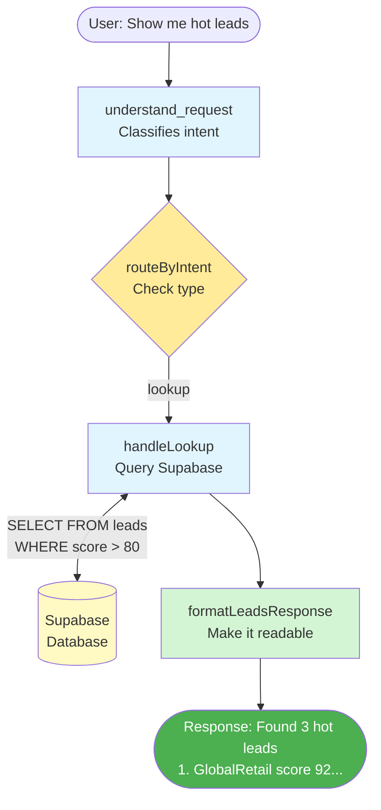
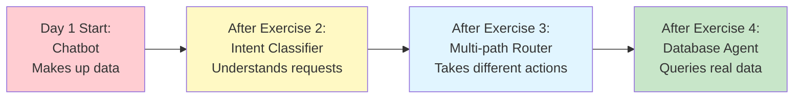

# Exercise 4: Query Your Leads

## Learning Objectives

By the end of this exercise, you'll:
- Connect your agent to real Supabase data
- Transform user intent into database queries
- Handle query results and errors
- Format lead data into human-readable responses

## Scenario

Your agent can understand "Show me hot leads" and route to the right handler. But the handler just returns a placeholder. Time to make it real.

You'll connect to your Supabase database and actually fetch the leads.

## Your Task

### 🤖 Using Cursor Effectively in This Exercise

This exercise combines database queries with workflow logic. Cursor workflow:

**For Supabase Setup (Steps 1-2):**
- Copy the setup code provided
- If you get import errors, select the error and ask Cursor: "Fix this Deno import"

**For Query Building (Step 3):**
1. **First, plan your logic** (write comments):
   ```typescript
   // If target is "hot" → filter score > 80
   // If target is "new" → filter status = "new"
   // Otherwise → search company_name
   ```
2. **Then use Cursor** for Supabase syntax:
   - Highlight your comment: `// filter score > 80`
   - Press `Cmd+K` → "Add Supabase query filter for this"

**For Response Formatting (Step 4):**
- This is pure TypeScript string manipulation
- Try writing it yourself first using `.map()` and template strings
- Use Cursor only if stuck: "Help me format this Lead array into a numbered list with company names"

**Advanced Cursor Technique:**
- After implementing, select your `handleLookup` function
- Ask Cursor: "What edge cases am I missing?" (empty results? null values? SQL injection?)

**Debugging Database Issues:**
- Error: "relation does not exist" → Ask Cursor: "How do I check if my Supabase table exists?"
- Empty results → Ask Cursor: "Debug this Supabase query that returns no data"

---

### Step 1: Set Up Supabase Client (5 min)

Add the Supabase client to your `agent.ts`:

```typescript
import { createClient } from "https://esm.sh/@supabase/supabase-js@2";

// Initialize Supabase (do this once at the top)
const supabaseUrl = Deno.env.get("SUPABASE_URL")!;
const supabaseKey = Deno.env.get("SUPABASE_SERVICE_ROLE_KEY")!;
const supabase = createClient(supabaseUrl, supabaseKey);
```

### Step 2: Add Lead Type to State (5 min)

Update your `AgentState` to hold lead data:

```typescript
// Add this type (or import from types.ts)
interface Lead {
  id: string;
  company_name: string;
  contact_name: string;
  contact_email: string;
  status: string;
  score: number;
  estimated_value: number | null;
  notes: string | null;
}

interface AgentState {
  userMessage: string;
  intent: {
    type: "lookup" | "qualify" | "followup" | "update" | "unknown";
    target?: string;
    details?: string;
  } | null;
  leads: Lead[];  // ADD THIS
  response: string | null;
  error: string | null;
}
```

Update your state channels:

```typescript
const workflow = new StateGraph<AgentState>({
  channels: {
    userMessage: { value: (a, b) => b ?? a },
    intent: { value: (a, b) => b ?? a },
    leads: { value: (a, b) => b ?? a },  // ADD THIS
    response: { value: (a, b) => b ?? a },
    error: { value: (a, b) => b ?? a },
  },
});
```

### Step 3: Implement the Real Lookup Handler (25 min)

Replace your placeholder `handleLookup` with one that actually queries Supabase:

```typescript
async function handleLookup(state: AgentState): Promise<Partial<AgentState>> {
  const target = state.intent?.target?.toLowerCase() || "";
  
  try {
    // TODO: Build the query based on what the user asked for
    let query = supabase.from("leads").select("*");
    
    // Determine what kind of lookup this is
    if (target === "" || target === "all") {
      // "Show me all leads" - no filter
      // Just order by score
      query = query.order("score", { ascending: false });
      
    } else if (target === "hot" || target === "high value") {
      // "Show me hot leads" - filter by high score
      // TODO: Add filter for score > 80
      
    } else if (target === "new") {
      // "Show me new leads" - filter by status
      // TODO: Add filter for status = 'new'
      
    } else {
      // Assume it's a company name search
      // TODO: Add ilike filter for company_name containing target
      
    }
    
    // Execute the query
    const { data, error } = await query;
    
    if (error) {
      console.error("Supabase error:", error);
      return {
        error: `Database error: ${error.message}`,
        response: "Sorry, I couldn't fetch the leads. Please try again.",
      };
    }
    
    // Handle empty results
    if (!data || data.length === 0) {
      return {
        leads: [],
        response: target 
          ? `No leads found matching "${target}".`
          : "No leads found in the database.",
      };
    }
    
    // TODO: Format the results into a nice response
    // See Step 4 for formatLeadsResponse helper
    
    return {
      leads: data,
      response: formatLeadsResponse(data, target),
    };
    
  } catch (e) {
    console.error("Unexpected error in handleLookup:", e);
    return {
      error: `Unexpected error: ${e.message}`,
      response: "Something went wrong. Please try again.",
    };
  }
}
```

Fill in the TODOs! Here are the Supabase filter methods you'll need:

```typescript
// Filter: score greater than 80
query = query.gt("score", 80);

// Filter: status equals "new"
query = query.eq("status", "new");

// Filter: company_name contains string (case-insensitive)
query = query.ilike("company_name", `%${searchTerm}%`);
```

### Step 4: Format the Response (10 min)

Create a helper function to turn lead data into readable text:

```typescript
function formatLeadsResponse(leads: Lead[], queryType: string): string {
  // TODO: Implement this function
  // It should return a nicely formatted string like:
  //
  // Found 3 hot leads:
  //
  // 1. GlobalRetail Inc (Amanda Rodriguez)
  //    Score: 92 | Status: proposal | Value: $120,000
  //
  // 2. TechCorp Solutions (Sophie Martin)  
  //    Score: 85 | Status: qualified | Value: $45,000
  //
  // 3. MegaBank Financial (Dr. James Wright)
  //    Score: 78 | Status: qualified | Value: $80,000
  
  // Hints:
  // - Use leads.length to show count
  // - Use leads.map() to format each lead
  // - Use template strings for formatting
  // - Format estimated_value as currency
  
  const header = queryType 
    ? `Found ${leads.length} lead${leads.length === 1 ? "" : "s"} matching "${queryType}":`
    : `Found ${leads.length} lead${leads.length === 1 ? "" : "s"}:`;
  
  const leadLines = leads.map((lead, index) => {
    // TODO: Format each lead
    // Return a string like:
    // "1. CompanyName (ContactName)\n   Score: X | Status: Y | Value: $Z"
  });
  
  return `${header}\n\n${leadLines.join("\n\n")}`;
}
```

### Step 5: Test With Real Data (10 min)

Make sure your database has the sample data from the schema file, then test:

```typescript
async function testRealQueries() {
  const testCases = [
    "Show me all my leads",
    "Show me hot leads",
    "What's the status of TechCorp?",
    "Show me new leads",
    "Find GlobalRetail",
    "Show me leads from FakeCompany",  // Should return "no leads found"
  ];
  
  for (const message of testCases) {
    console.log(`\n${"=".repeat(60)}`);
    console.log(`Query: "${message}"`);
    
    const result = await app.invoke({
      userMessage: message,
      intent: null,
      leads: [],
      response: null,
      error: null,
    });
    
    console.log(`\nResponse:\n${result.response}`);
    console.log(`\nLeads returned: ${result.leads?.length || 0}`);
    if (result.error) {
      console.log(`Error: ${result.error}`);
    }
  }
}

testRealQueries();
```

## Success Criteria

- [ ] "Show me all leads" returns all 5 sample leads
- [ ] "Show me hot leads" returns only leads with score > 80
- [ ] "Find TechCorp" returns the TechCorp lead
- [ ] "Show me new leads" returns leads with status = "new"
- [ ] "Find FakeCompany" returns "No leads found" (not an error)
- [ ] Database errors don't crash the agent

## Debugging Tips

**If you get "relation does not exist" error:**
- You haven't run the schema SQL in Supabase
- Go to SQL Editor in Supabase dashboard and run `starter-kit/supabase-schema.sql`

**If queries return empty but data exists:**
- Check your filter syntax
- Try running the query directly in Supabase SQL editor
- Make sure `ilike` uses `%` wildcards: `%techcorp%` not `techcorp`

**If you get RLS errors:**
- Make sure you're using `SUPABASE_SERVICE_ROLE_KEY` not `SUPABASE_ANON_KEY`
- The service role key bypasses RLS

**If formatting looks weird:**
- Test `formatLeadsResponse` with hardcoded data first
- Check for undefined values (use optional chaining: `lead.estimated_value?.toLocaleString()`)

## What You Just Built

Your agent now:
1. ✅ Understands natural language requests
2. ✅ Routes to the appropriate handler
3. ✅ Queries a real database
4. ✅ Formats results for humans
5. ✅ Handles errors gracefully

### Your Complete Day 1 Agent



This is a *read-only* agent. It can answer questions but can't change anything. Tomorrow, we add the ability to update leads, send emails, and — critically — ask for human approval before doing anything dangerous.

### The Journey: Chatbot → Agent



## Stretch Goal

Add a "detailed" mode. If the user asks "Tell me everything about TechCorp", include:
- All the basic info
- The notes field
- When the lead was created
- When it was last updated
- Recent interactions (query the `interactions` table and join)

This will require:
1. Detecting "detailed" requests in your intent classifier
2. A more complex Supabase query (potentially with joins)
3. A different formatting function for detailed output
