# When Agents Go Wrong

## Yesterday's Agent Has a Problem

Yesterday you built something impressive: an agent that understands requests, routes intelligently, and queries real data. You should be proud.

But I need to tell you something uncomfortable: **your agent is not production-ready**. Not even close.

Here's what happens when things go wrong in your current agent:

```typescript
// User asks about a company that doesn't exist
"Find the XYZ Corp lead"

// Your agent:
1. Classifies intent as "lookup" ✓
2. Queries Supabase ✓
3. Gets empty result ✓
4. Returns "No leads found" ✓

// Seems fine, right? 
```

But what about this:

```typescript
// Supabase is temporarily down (it happens)
"Show me hot leads"

// Your agent:
1. Classifies intent as "lookup" ✓
2. Queries Supabase... 
3. Connection timeout
4. Unhandled exception
5. Edge Function crashes
6. User sees: "Internal Server Error"
7. You see: Nothing (no logs, no alerts)
```

Or worse:

```typescript
// User gives ambiguous input
"Update the lead"

// Your agent:
1. Classifies intent as "update" ✓
2. Routes to update handler ✓
3. No target specified...
4. Handler tries to update... what exactly?
5. Either crashes or updates the wrong thing
6. User is confused or angry
```

## The Three Ways Agents Fail

After working with AI agents in production, I've seen them fail in three main ways:

### 1. Silent Failures

The agent encounters an error but doesn't tell anyone. It either:
- Returns a generic "something went wrong" message
- Returns a plausible-sounding but wrong answer
- Hangs forever

**Why it happens**: Developers catch exceptions but don't handle them meaningfully.

```typescript
// This code is EVERYWHERE and it's terrible
try {
  await riskyOperation();
} catch (e) {
  console.log(e);  // Logged to nowhere
  return { response: "Please try again" };  // Useless
}
```

### 2. Infinite Loops

The agent gets stuck in a cycle, burning through API credits and compute time:

```
THINK: "I need more information about this lead"
ACT: Query database (returns same result)
THINK: "I still need more information"  
ACT: Query database again (same result)
THINK: "I still need more information"
[...repeat until timeout or bankruptcy]
```

**Why it happens**: The agent's decision logic doesn't account for "already tried this" scenarios.

### 3. Hallucinated Actions

The agent decides to do something that doesn't make sense:

```typescript
// User: "Send a summary to the team"
// Agent thinks: "I should send an email"
// Agent does: Sends email to random email address it made up
```

**Why it happens**: The LLM's imagination fills in gaps that should be explicit validation.

## Why Agents Fail Differently Than Normal Code

Regular code fails in predictable ways. If you forget to handle a null, you get a null pointer exception. Same input, same bug, every time.

Agents are probabilistic. The same input can produce different behavior because:

1. **LLM non-determinism**: Even with temperature=0, outputs vary slightly
2. **External dependencies**: APIs, databases, and networks are unreliable
3. **State accumulation**: Previous steps affect future decisions
4. **Prompt injection**: User input can manipulate agent behavior

This means **you can't just write tests and call it done**. You need:
- Guardrails (prevent bad actions before they happen)
- Monitoring (see what's actually happening)
- Human oversight (catch what automation misses)
- Graceful degradation (fail safely when things go wrong)

## Real Agent Failures (True Stories)

**The Resume Bot Incident (2024)**
A recruiting company deployed an AI agent to respond to job applicants. Due to a prompt injection in a resume, the agent started sending interview invitations to fake email addresses. 200 invitations went out before anyone noticed.

**The Customer Support Loop**
A support agent got stuck in a loop because it kept trying to "verify" customer information by re-reading the same ticket. It made 847 API calls in 3 minutes before hitting rate limits.

**The Helpful Database Agent**
An internal tool let users query company data with natural language. A user asked "delete the old records" meaning "show me records to delete." The agent interpreted it literally. Fortunately, the database had backups.

## The Solution: Defense in Depth

We'll address each failure mode this morning:

| Failure Mode | Solution | Today's Exercise |
|--------------|----------|------------------|
| Silent failures | Structured error handling | Exercise 3 |
| Infinite loops | Retry limits + circuit breakers | Exercise 1 |
| Hallucinated actions | Human-in-the-loop | Exercise 2 |
| Unexpected behavior | Logging + observability | All exercises |

**The philosophy**: Assume everything will fail. Design for it.

## Today's Mission

By end of day, your agent will:
1. Detect and recover from failures gracefully
2. Ask for human approval before sensitive actions
3. Never loop more than N times
4. Log everything it does (and why)
5. Deploy to a real Edge Function

This is the difference between a demo and a product.

### Production-Ready Agent Architecture

Here's what we're building today:

```mermaid
graph TB
    subgraph "Your Agent Today"
        A[User Request] --> B[Classify Intent]
        B --> C{What Action?}
        C -->|Query| D[Query Database]
        C -->|Update| E{High Value?}
        C -->|Email| F[Draft Email]
        
        E -->|Yes| G[🛑 Human Approval]
        E -->|No| H[Update Directly]
        G -->|Approved| H
        G -->|Rejected| I[Cancel Gracefully]
        
        F --> J[🛑 Human Approval]
        J -->|Approved| K[Send Email]
        J -->|Rejected| I
        
        D --> L{Success?}
        H --> L
        K --> L
        
        L -->|Yes| M[✅ Return Response]
        L -->|No| N{Should Retry?}
        N -->|Yes| O[Wait & Retry<br/>Exponential Backoff]
        O --> L
        N -->|No| P[Error Recovery]
        P --> Q[User-Friendly Error]
    end
    
    subgraph "Safeguards We're Adding"
        R[Max Retries]
        S[Approval Gates]
        T[Error Logging]
        U[Graceful Degradation]
    end
    
    style G fill:#ff9999
    style J fill:#ff9999
    style O fill:#ffffcc
    style P fill:#ffcccc
```



**Yesterday**: Basic agent that works when everything goes right.  
**Today**: Production-grade agent that handles when things go wrong.

## Up Next

First, you'll experience failure firsthand. In Exercise 1, you'll be given an intentionally broken agent and asked to debug it. The bugs are real patterns I've seen in production. Let's go break things (on purpose).
