# Human-in-the-Loop

## The Trust Spectrum

Think about the actions your CRM agent might take:

| Action | Risk Level | Should it need approval? |
|--------|------------|--------------------------|
| Show lead info | None | No - read-only |
| Update lead status | Low | Maybe |
| Change lead score | Medium | Probably |
| Send email to lead | High | Yes |
| Delete lead record | Critical | Absolutely |

Not all actions are equal. Some you're fine with automation. Others you want to see before they happen.

This is the **trust spectrum**: how much autonomy you give your agent depends on what it's doing.

## What Human-in-the-Loop Means

Human-in-the-loop (HITL) is a simple concept:

1. Agent decides it wants to do something
2. Instead of doing it, agent **pauses**
3. Human reviews the proposed action
4. Human approves or rejects
5. If approved, agent proceeds
6. If rejected, agent handles the rejection gracefully

In LangGraph terms, this looks like:

```mermaid
graph TD
    A[Agent Decides Action] --> B{Needs Approval?}
    B -->|No - Safe Action| C[Execute Immediately]
    B -->|Yes - Risky Action| D[🛑 Pause & Wait for Human]
    D --> E{Human Decision}
    E -->|✅ Approved| F[Execute Action]
    E -->|❌ Rejected| G[Handle Rejection Gracefully]
    C --> H[Continue Workflow]
    F --> H
    G --> H
    
    style D fill:#ff9999
    style E fill:#ffeb99
    style F fill:#99ff99
```



The `human_review` node is special — it **interrupts** the workflow and waits for input.

## Implementing Checkpoints in LangGraph

LangGraph supports interrupting workflows with checkpoints. Here's the pattern:

```typescript
import { StateGraph, END, interrupt } from "@langchain/langgraph";

interface AgentState {
  // ... your existing state
  pendingAction: {
    type: string;
    description: string;
    data: any;
  } | null;
  approved: boolean | null;
}

async function humanReview(state: AgentState): Promise<Partial<AgentState>> {
  // This is where we pause for human input
  // In a real system, this would:
  // 1. Save the state to a database
  // 2. Send a notification (email, Slack, etc.)
  // 3. Wait for response via API
  
  // For this exercise, we'll simulate with a simple interrupt
  const approval = await interrupt({
    action: state.pendingAction,
    message: `Agent wants to: ${state.pendingAction?.description}`,
    options: ["approve", "reject"],
  });
  
  return {
    approved: approval === "approve",
  };
}
```

## When to Require Approval

There's no universal rule, but here are solid guidelines:

**Always require approval for:**
- Writing to databases (especially deletes/updates)
- Sending communications (emails, messages)
- Financial transactions
- Actions that can't be undone

**Consider approval for:**
- First-time actions (until you trust the pattern)
- High-value contexts (big deals, important customers)
- Ambiguous requests (agent isn't confident)

**Skip approval for:**
- Read-only operations
- Frequently-repeated safe actions
- Low-stakes contexts (sandbox/testing)

## The Approval UX

Your agent pausing is useless if the human can't respond. You need:

1. **Clear description** of what the agent wants to do
2. **Context** about why (what led to this decision)
3. **Easy approve/reject** mechanism
4. **Timeout handling** (what if human doesn't respond?)

Here's what a good approval request looks like:

```json
{
  "pending_action": {
    "type": "update_lead",
    "lead_id": "abc-123",
    "lead_name": "TechCorp Solutions",
    "changes": {
      "status": "won",
      "notes": "Deal closed - signed contract received"
    }
  },
  "reasoning": "User said 'mark TechCorp as won'. Lead score is 85 (high value), so requiring approval.",
  "requested_at": "2025-01-31T10:30:00Z",
  "timeout_at": "2025-01-31T11:30:00Z",
  "approve_url": "/api/approve/abc-123",
  "reject_url": "/api/reject/abc-123"
}
```

The human sees exactly what will happen and can make an informed decision.

## Handling Rejection Gracefully

What happens when the human says "no"?

**Bad pattern:**
```typescript
if (!approved) {
  throw new Error("Action rejected");  // Workflow crashes
}
```

**Good pattern:**
```typescript
if (!approved) {
  return {
    response: "Got it — I won't update TechCorp. Let me know if you'd like me to do something else.",
    pendingAction: null,  // Clear the pending action
  };
}
```

The agent acknowledges the rejection and continues gracefully. It doesn't sulk or crash.

## The Approval Workflow for Our CRM

For your CRM agent, here's the rule we'll implement:

> Any lead with score > 80 is "high value."
> Any write operation on a high-value lead requires human approval.

This means:
- Looking up TechCorp (score: 85)? No approval needed - it's read-only.
- Updating LocalCafe status (score: 25)? No approval needed - low value.
- Updating TechCorp status (score: 85)? **Approval required** - high value write.
- Sending email to anyone? **Approval required** - external communication.

The logic in code:

```typescript
function needsApproval(action: AgentAction, lead: Lead | null): boolean {
  // Always approve external communications
  if (action.type === "send_email") return true;
  
  // Write operations on high-value leads need approval
  if (action.type === "update_lead" && lead && lead.score > 80) return true;
  
  // Everything else is auto-approved
  return false;
}
```

## Approval Flow in State

Your state needs to track:

```typescript
interface AgentState {
  // ... existing fields
  
  // What the agent wants to do
  pendingAction: AgentAction | null;
  
  // Has it been reviewed?
  approvalStatus: "pending" | "approved" | "rejected" | null;
  
  // If rejected, why?
  rejectionReason: string | null;
}
```

The workflow:

1. Agent decides to take action
2. Checks if approval needed
3. If yes: sets `pendingAction` and `approvalStatus: "pending"`, returns
4. Human reviews (via API, UI, whatever)
5. System updates `approvalStatus` and resumes workflow
6. Agent reads approval status and proceeds (or doesn't)

## Testing Approval Flows

You can't wait for a human in tests. Instead:

```typescript
// In tests, auto-approve or auto-reject
async function testApprovalFlow() {
  // Mock the approval check
  const mockApproval = (state: AgentState) => ({
    approved: true,  // or false to test rejection
    reviewedBy: "test-user",
    reviewedAt: new Date().toISOString(),
  });
  
  // Run with mock
  const result = await runWithMockedApproval(agent, input, mockApproval);
  
  // Verify behavior
  expect(result.leadUpdated).toBe(true);
}
```

## Up Next

Time to implement this. In Exercise 2, you'll add an approval gate to your agent. When someone tries to update a high-value lead, the agent will pause and wait.
