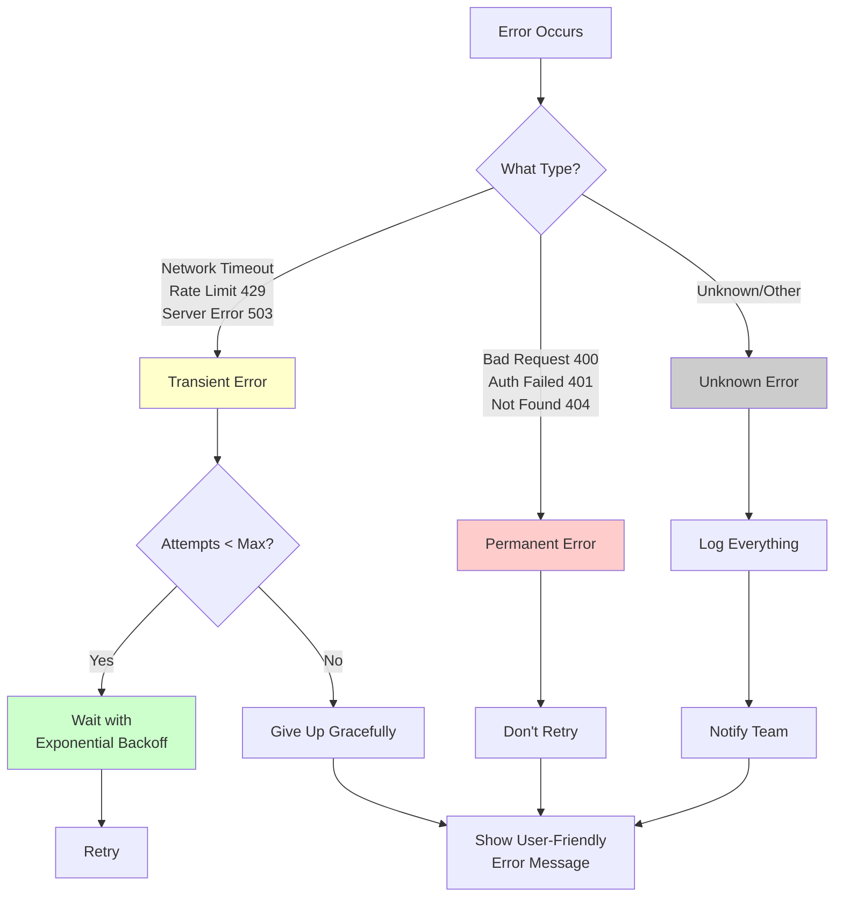
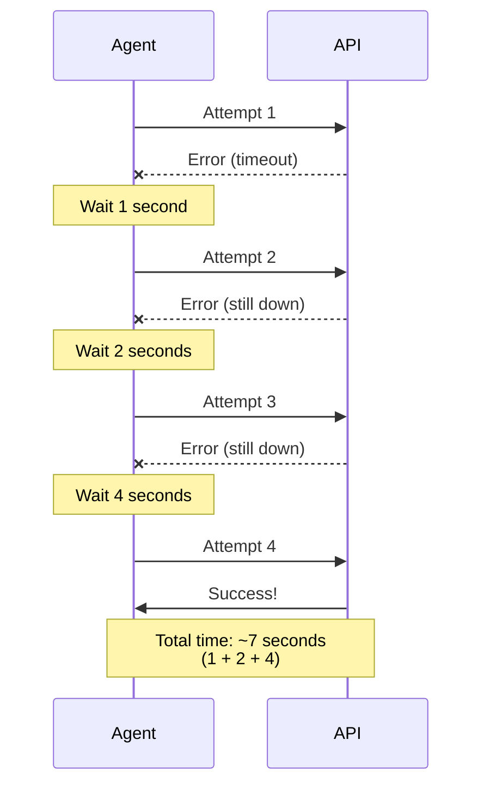

# Error Handling That Works

## The Error Handling Most People Write

```typescript
try {
  await doSomething();
} catch (error) {
  console.log("Error:", error);
  return { error: "Something went wrong" };
}
```

This is better than nothing. But it's not good enough for agents. Here's why:

1. **No retry logic**: If the network hiccuped, we just give up
2. **Generic message**: User has no idea what actually failed
3. **No recovery path**: The workflow stops dead
4. **Lost context**: We logged the error but didn't preserve it in state

## Error Handling for Agents

Agents need smarter error handling because:
- They make multiple external calls (LLM, database, APIs)
- Each call can fail independently
- Users expect graceful degradation, not crashes
- You need to debug issues after the fact

Here's the pattern that actually works:

```typescript
async function resilientNode(state: AgentState): Promise<Partial<AgentState>> {
  const MAX_RETRIES = 3;
  const RETRY_DELAY = 1000; // ms
  
  for (let attempt = 1; attempt <= MAX_RETRIES; attempt++) {
    try {
      const result = await riskyOperation();
      
      // Success! Clear any previous error state
      return {
        data: result,
        error: null,
        retryCount: 0,
      };
      
    } catch (error) {
      const isLastAttempt = attempt === MAX_RETRIES;
      
      // Log with context
      console.error(`[${state.currentStep}] Attempt ${attempt}/${MAX_RETRIES} failed:`, error);
      
      if (isLastAttempt) {
        // Give up but do it gracefully
        return {
          error: formatErrorForUser(error),
          errorDetails: formatErrorForLogs(error),
          currentStep: "error_recovery",
        };
      }
      
      // Wait before retrying (exponential backoff)
      await delay(RETRY_DELAY * Math.pow(2, attempt - 1));
    }
  }
  
  // TypeScript requires this, but we'll never reach it
  return { error: "Unexpected error flow" };
}
```

## Different Errors, Different Handling

Not all errors are equal. Your handling should differ:



### Transient Errors (Retry)

Network timeouts, rate limits, temporary unavailability. These often resolve themselves.

```typescript
if (error.code === 'ETIMEDOUT' || error.status === 429 || error.status === 503) {
  // Worth retrying
  await delay(calculateBackoff(attempt));
  continue;
}
```

### Permanent Errors (Don't Retry)

Invalid input, authentication failure, resource not found. Retrying won't help.

```typescript
if (error.status === 400 || error.status === 401 || error.status === 404) {
  // Don't retry, handle gracefully
  return {
    error: `Cannot complete request: ${error.message}`,
    currentStep: "user_clarification",
  };
}
```

### Unknown Errors (Log and Fail Gracefully)

Something unexpected. Log everything for debugging, fail with dignity.

```typescript
// For anything else
console.error("Unexpected error:", {
  error,
  state: sanitizeStateForLogs(state),
  timestamp: new Date().toISOString(),
});

return {
  error: "An unexpected error occurred. Our team has been notified.",
  currentStep: "error_recovery",
};
```

## Exponential Backoff

When retrying, don't hammer the service. Use exponential backoff:

```
Attempt 1: Wait 1 second
Attempt 2: Wait 2 seconds
Attempt 3: Wait 4 seconds
Attempt 4: Wait 8 seconds
```

### Why Exponential Backoff Works

Think of it like knocking on a busy person's office door:

```
Attempt 1: *knock* wait 1 second
  └─> "Maybe they're just finishing something"

Attempt 2: *knock* wait 2 seconds
  └─> "Maybe they're in a meeting"

Attempt 3: *knock* wait 4 seconds  
  └─> "Maybe they're away from their desk"

Attempt 4: *knock* wait 8 seconds
  └─> "Okay, they're really not available"
```

You don't keep knocking every second — that's annoying and wastes your energy. Instead, you give them progressively more time to become available.

**Same with API calls**:
- Short delay first (maybe it was just a hiccup)
- Longer delays later (give the service time to recover)
- Eventually give up (they're really down)

**Jitter** (randomness) prevents a "thundering herd":

Imagine 1,000 clients all failed at the same time. Without jitter, they'd ALL retry at exactly 1s, 2s, 4s... hitting the recovering service with massive synchronized load. With jitter, retries are spread out over time:

```
Without jitter:     With jitter (10-30% random):
1.0s: ||||||||      1.0s-1.3s: ||  || | ||  |
2.0s: ||||||||      2.0s-2.6s:  | ||   || |  ||
4.0s: ||||||||      4.0s-5.2s: |  | ||   | || |
```

The service has time to breathe between retry waves.

### Visual Timeline

Here's what retry attempts look like over time:



**Key insight**: We waited a total of 7 seconds across 4 attempts. If we'd retried every second, we would have made 7 attempts and probably still failed. Exponential backoff gives the service time to recover while using fewer attempts.

### Implementation

In code:

```typescript
function calculateBackoff(attempt: number, baseDelay = 1000): number {
  // Add some randomness to prevent thundering herd
  const jitter = Math.random() * 0.3; // 0-30% extra
  return baseDelay * Math.pow(2, attempt - 1) * (1 + jitter);
}

async function delay(ms: number): Promise<void> {
  return new Promise(resolve => setTimeout(resolve, ms));
}
```

---

**⚡ Advanced Pattern Ahead**

The circuit breaker pattern below is an **advanced technique** used in high-scale production systems. It's included here for completeness and to show you what's possible, but **you won't implement it in Exercise 3**. 

Focus on mastering retry logic and graceful error handling first. Circuit breakers are a "nice to have" for future scaling — bookmark this section for when you're building high-traffic systems.

---

## Circuit Breakers

If a service is down, continuously retrying makes things worse. A circuit breaker prevents this:

```typescript
class CircuitBreaker {
  private failures = 0;
  private lastFailure: Date | null = null;
  private readonly threshold = 5;
  private readonly resetTimeout = 60000; // 1 minute
  
  async execute<T>(fn: () => Promise<T>): Promise<T> {
    if (this.isOpen()) {
      throw new Error("Circuit breaker is open - service unavailable");
    }
    
    try {
      const result = await fn();
      this.reset();
      return result;
    } catch (error) {
      this.recordFailure();
      throw error;
    }
  }
  
  private isOpen(): boolean {
    if (this.failures < this.threshold) return false;
    
    // Check if enough time has passed to try again
    const timeSinceFailure = Date.now() - (this.lastFailure?.getTime() || 0);
    return timeSinceFailure < this.resetTimeout;
  }
  
  private recordFailure(): void {
    this.failures++;
    this.lastFailure = new Date();
  }
  
  private reset(): void {
    this.failures = 0;
    this.lastFailure = null;
  }
}
```

Usage:

```typescript
const supabaseBreaker = new CircuitBreaker();

async function queryLeads(state: AgentState) {
  try {
    const data = await supabaseBreaker.execute(() => 
      supabase.from("leads").select("*")
    );
    return { leads: data };
  } catch (error) {
    if (error.message.includes("Circuit breaker")) {
      return {
        error: "Database is temporarily unavailable. Please try again in a minute.",
        currentStep: "error_recovery",
      };
    }
    throw error;
  }
}
```

## Error Messages for Users vs Logs

Users need friendly, actionable messages. Logs need technical details.

```typescript
function formatErrorForUser(error: any): string {
  // Map technical errors to human messages
  if (error.code === 'PGRST116') {
    return "I couldn't find that lead. Could you check the name?";
  }
  if (error.status === 429) {
    return "I'm processing too many requests. Please wait a moment.";
  }
  if (error.message?.includes('timeout')) {
    return "The request took too long. Please try again.";
  }
  
  // Generic fallback
  return "Something went wrong. Please try again or rephrase your request.";
}

function formatErrorForLogs(error: any): object {
  return {
    message: error.message,
    code: error.code,
    status: error.status,
    stack: error.stack,
    timestamp: new Date().toISOString(),
  };
}
```

## Error Recovery Nodes

Instead of crashing, route to a recovery node:

```typescript
// In your graph
workflow.addNode("error_recovery", async (state: AgentState) => {
  // Log the error for debugging
  console.error("Error recovery triggered:", state.errorDetails);
  
  // Try to give a helpful response
  const errorType = classifyError(state.error);
  
  switch (errorType) {
    case "database_unavailable":
      return {
        response: "I can't access the database right now. Try asking about something else, or try again in a few minutes.",
      };
      
    case "invalid_input":
      return {
        response: `I couldn't process that request. ${state.error}\n\nCould you rephrase or give me more details?`,
      };
      
    case "rate_limited":
      return {
        response: "I'm getting rate limited. Let me know when you'd like to try again.",
      };
      
    default:
      return {
        response: "I ran into an issue. Here's what I can do:\n- Try asking differently\n- Ask about a different topic\n- Wait a moment and try again",
      };
  }
});

// Route errors to recovery
workflow.addConditionalEdges(
  "any_node",
  (state) => state.error ? "error_recovery" : "next_node",
  {
    error_recovery: "error_recovery",
    next_node: "next_node",
  }
);
```

## Tracking Errors in State

Your state should track error history, not just current error:

```typescript
interface AgentState {
  // Current error (if any)
  error: string | null;
  errorDetails: object | null;
  
  // Error history for debugging
  errorLog: Array<{
    step: string;
    error: string;
    timestamp: string;
    recovered: boolean;
  }>;
  
  // Retry tracking
  retryCount: number;
  maxRetries: number;
}
```

This lets you:
- See patterns across multiple runs
- Debug issues after the fact
- Know when errors were recovered vs fatal

## Up Next

You've learned the theory. In Exercise 3, you'll add retry logic, circuit breakers, and graceful error handling to your agent. Plus, you'll integrate Resend for sending actual emails (with approval, of course).
